

  

# MOHD.HASANUDIN BIN ZAKARIA

**Senior Application Developer**

📧 cyberdin4ever@gmail.com | 📱 019-674 9342 | 📍 Kuala Terengganu, Terengganu | 💼 [LinkedIn Profile](https://www.linkedin.com/in/dev-hasanudin)

<!--img src="/assets/images/profile_pic1.jpg" alt="Profile Picture" width="200"/!-->

---

## Professional Summary

Versatile Senior Application Developer with 18+ years of progressive experience spanning full-stack development, system analysis, project management, and technical leadership. Demonstrated expertise across diverse technology stacks including Oracle ecosystems, GIS technologies, POS systems, and modern web frameworks. Proven track record of delivering mission-critical solutions for government agencies, financial institutions, retail operations, and manufacturing sectors. Adept at bridging technical and business requirements, leading cross-functional teams, and driving innovation through R&D initiatives.

---

## Core Competencies

**Development & Programming**
- Full-Stack Development (PHP)
- Oracle Database & PL/SQL
- Oracle JDeveloper, ADF & Forms
- 4GL & Shell Scripting

**Specialized Technologies**
- GIS Technologies (QGIS, SuperMap, Mapbox MVT)
- POS Systems & Retail IT Management
- Report Development (Jasper, Oracle, Crystal, Ariacom)

**Infrastructure & Operations**
- Linux/Unix Server Administration
- System Integration, Testing & Support
- Performance Tuning & Optimization
- Database Management (Oracle 10g/11g)

**Project Management**
- Requirements Gathering & Analysis
- Stakeholder Management
- Team Leadership & Mentoring

---

## Professional Experience

### Senior Application Developer
**LY Resources** | Nov 2025 - Present

- Enhanced and maintained Corridor Utility Systems for Terengganu, resolving bugs and improving system stability to ensure reliable infrastructure management.

#### Projects

| # | System/Application | Client | Job Scopes | Stage |
|---|-------------------|--------|------------|-------|
| 1 | Utility System | Koridor Utiliti Teknologi Terengganu | Developer & Support | Live |

**1. Utility System - Koridor Utiliti Teknologi Terengganu**
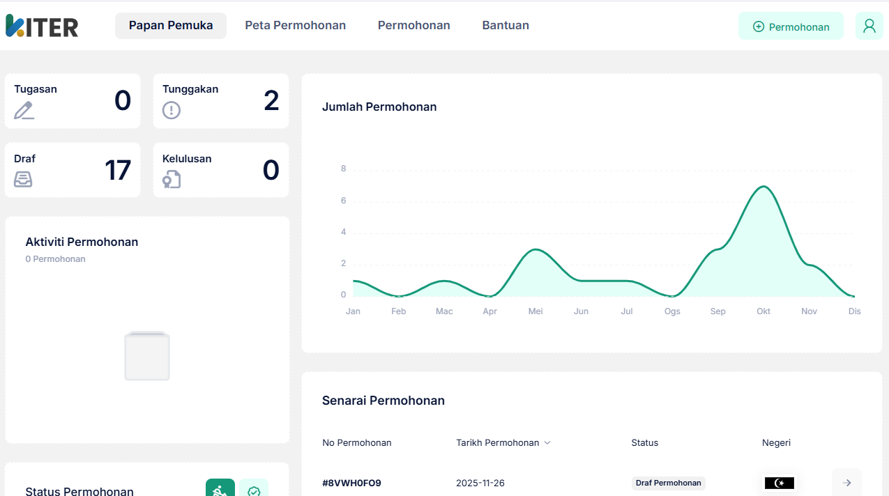
*Live production system for corridor utilities in Terengganu for an appplicant*

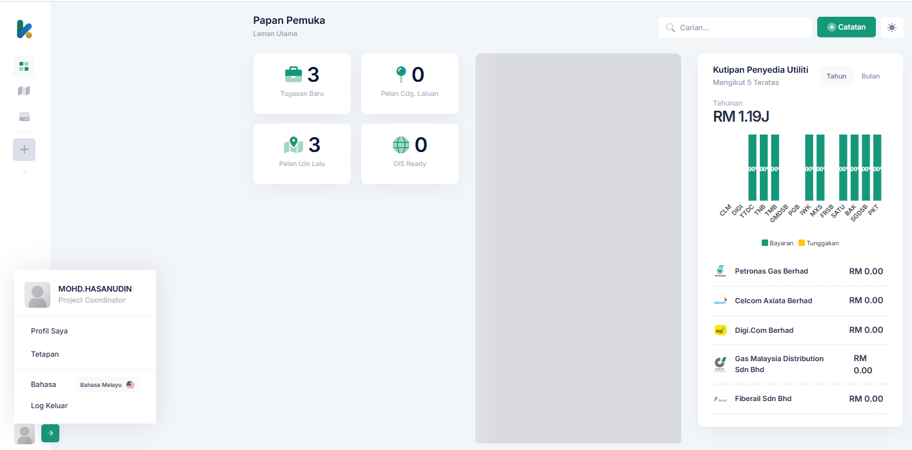
*Live production system for managing corridor utilities in Terengganu*

### Senior Application Developer
**Asia Debut Technology Sdn Bhd** | Jun 2024 - Nov 2025

- Enhanced and maintained Corridor Utility Systems for Terengganu and Perak, including the KUTT portal (kutt.my), resolving bugs and improving system stability across multiple state deployments.
- Coordinated with engineering and surveying teams to produce Wayleave Plans, Utility Detection Maps, and As-Built Plans, streamlining workflows and supporting technical decisions for infrastructure projects.
- Conducted R&D and implemented prototypes integrating Mapbox Vector Tiles (MVT), SuperMap GIS technologies, and Work Order Management System (WOMS), driving innovation in geospatial application development.

#### Projects

| # | System/Application | Client | Job Scopes | Stage |
|---|-------------------|--------|------------|-------|
| 1 | Utility System | Koridor Utiliti Teknologi Terengganu | Developer & Support | Live |
| 2 | Work Order Management System | ADT | Developer | RnD |
| 3 | SuperMap Map Viewer | ADT | Developer | RnD |
| 4 | MVT (Mapbox Vector Tiles) Map Viewer | ADT | Developer | RnD |

**2. Work Order Management System** 
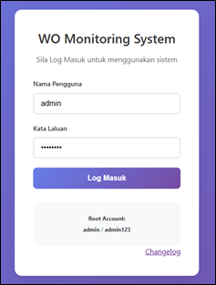 
*R&D project for streamlining work order processes - Login*

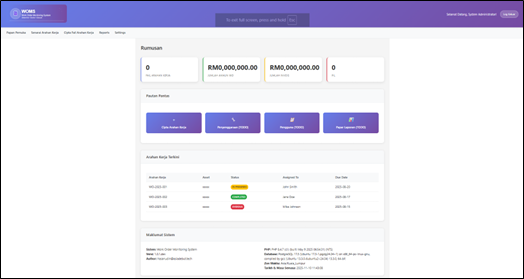 
*R&D project for streamlining work order processes - Dashboard*

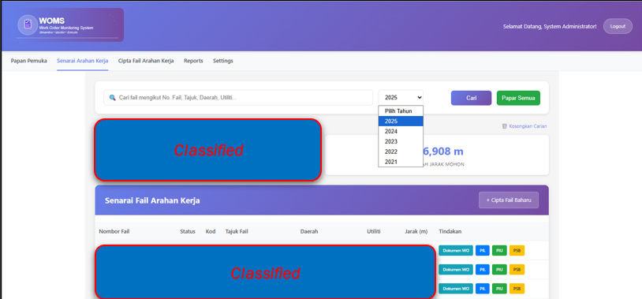 
*R&D project for streamlining work order processes - Lists*

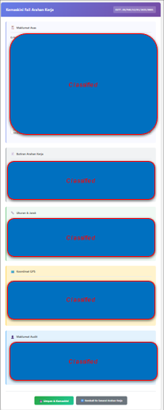 
*R&D project for streamlining work order processes - WO Update*

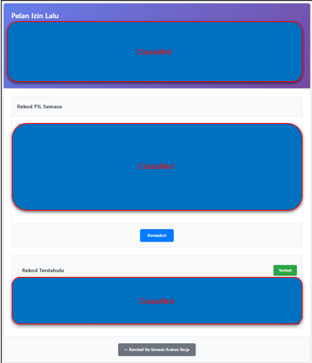 
*R&D project for streamlining work order processes - PIL Update*

**3. SuperMap Map Viewer** 
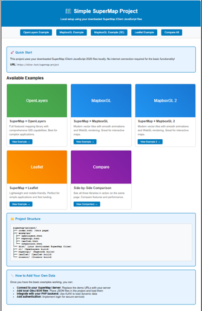 
*R&D project of GIS viewer using SuperMap technology - Dashboard*

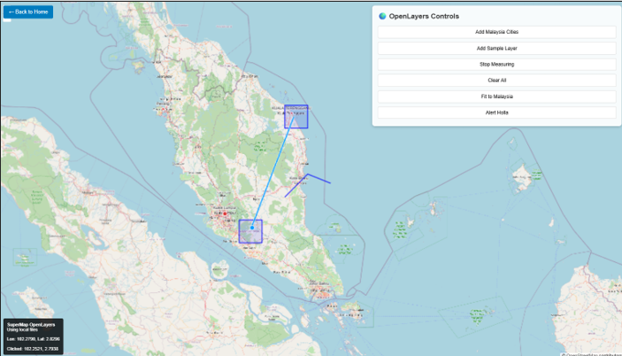 
*R&D project of GIS viewer using SuperMap technology - Open Layer*

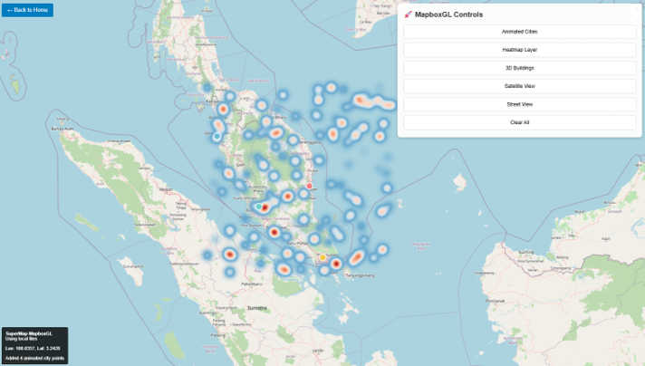 
*R&D project of GIS viewer using SuperMap technology - Mapbox GL*

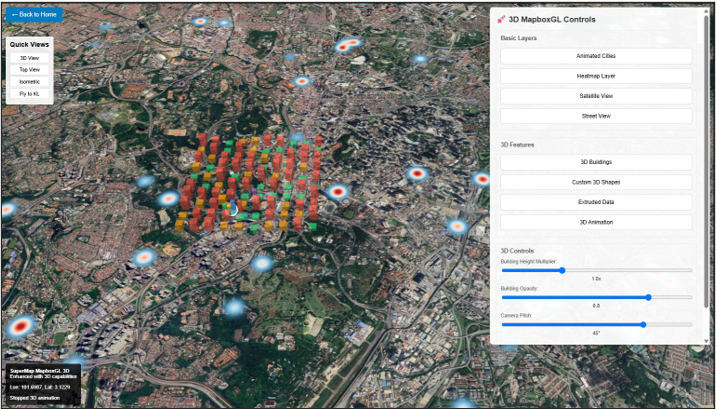 
*R&D project of GIS viewer using SuperMap technology - Mapbox GL (3D)*

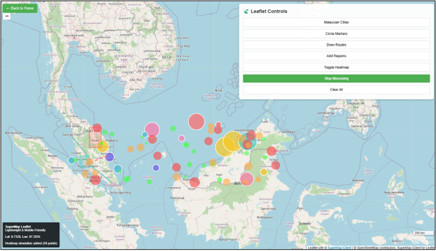 
*R&D project of GIS viewer using SuperMap technology - Leaflet*

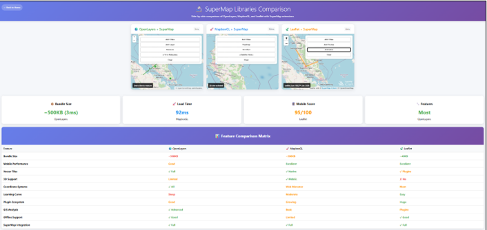 
*R&D project of GIS viewer using SuperMap technology - Comparison*

**4. MVT (Mapbox Vector Tiles) Map Viewer** 
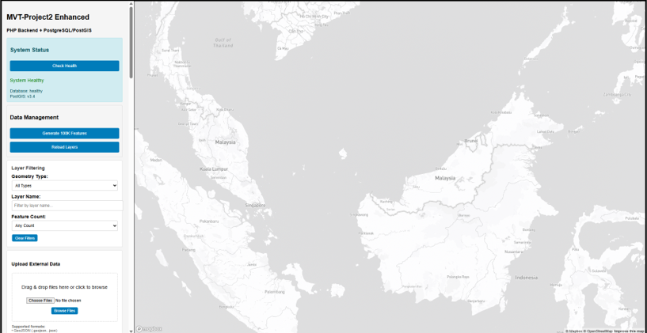 
*R&D project of GIS viewer using MVT technology - Dashboard*

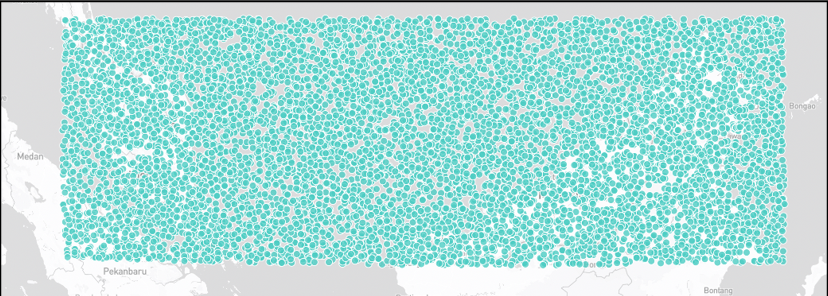 
*R&D project of GIS viewer using MVT technology - 100K Points*

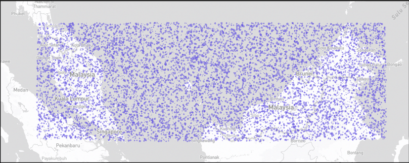 
*R&D project of GIS viewer using MVT technology - 100K Polygons*

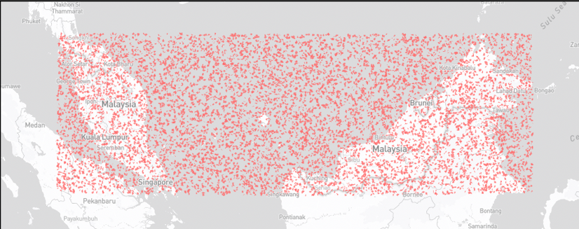 
*R&D project of GIS viewer using MVT technology - 100K Lines*

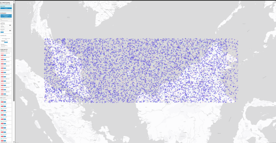 
*R&D project of GIS viewer using MVT technology - 100K Points + 100K Polygons + 100K Lines*

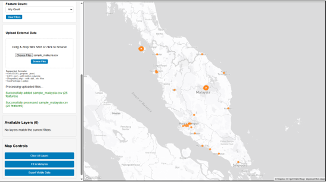 
*R&D project of GIS viewer using MVT technology - Upload .csv & .json*

### IT Executive
**Sabasun Hyperruncit Sdn Bhd** | Dec 2022 - May 2023

- Managed POS system (ARMS.my) and hardware infrastructure (CPUs, laptops, PDAs, scanners, printers), ensuring smooth retail operations across multiple store locations.
- Maintained corporate website (sabasun.com) and Microsoft 365 environment, updating content and publishing promotional campaigns to support marketing initiatives.
- Developed Technical Support System and "Superior Assessment" module, improving issue tracking, resolution workflows, and employee performance evaluation processes.

#### Projects

| # | System/Application | Client | Job Scopes | Stage |
|---|-------------------|--------|------------|-------|
| 1 | SABASUN Technical Support System | SABASUN | Developer | UAT |
| 2 | Internal Survey | SABASUN | Developer | Live |
| 3 | ARMS Point Of Sales | SABASUN | Administrator | Live |

**1. SABASUN Technical Support System (STSS)** 
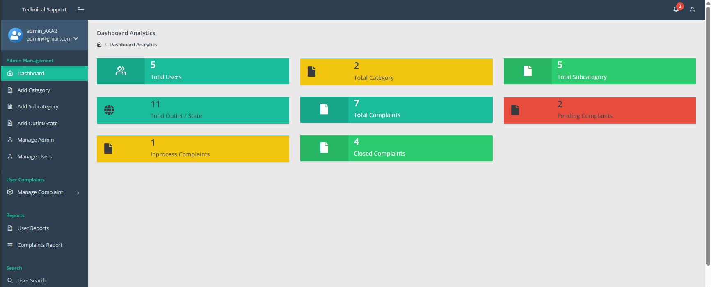 
*STSS for streamlining complaints - Dashboard*

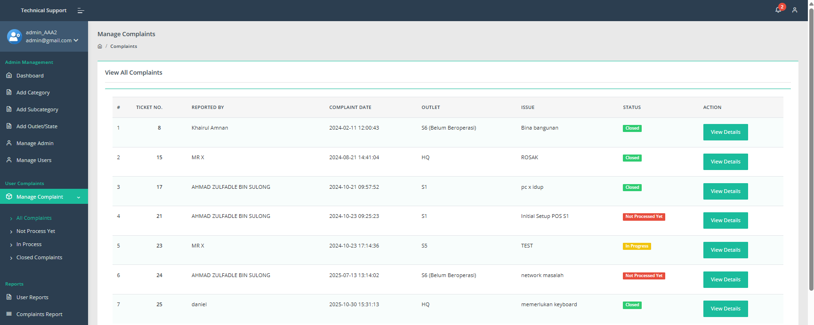 
*STSS for streamlining complaints - Manage Complaint*

**2. Internal Survey** 
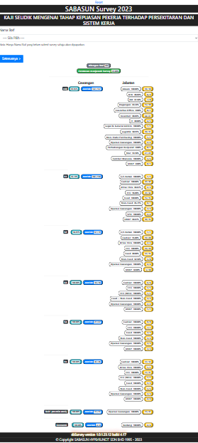 
*Internal survey for leader's assessments - Single display*

### IT Support
**Xiri Group Sdn Bhd** | Apr 2022 - Nov 2022

- Managed POS system (Pandasoftware.my) including setup, maintenance, and troubleshooting of software and hardware components, supporting retail operations across the organization.
- Maintained website and mobile app (MyXiri), updating promotional content and ensuring seamless customer experience across digital platforms.
- Ensured smooth IT operations across retail and operational departments, providing technical support and resolving system issues to minimize business disruption.

#### Projects

| # | System/Application | Client | Job Scopes | Stage |
|---|-------------------|--------|------------|-------|
| 1 | Panda Point Of Sales | XIRI Group | Administrator | Live |
| 2 | MyXiri Apps | XIRI Group | Administrator | Live |

### Programmer
**Firesell Sdn Bhd** | Jul 2017 - Oct 2021

- Led development of multiple core modules including eCash, Product Management, Commission, MyKad Verification, Blast SMS, Trading, and complex reporting components, ensuring accuracy, scalability, and smooth system operations for the agent platform.
- Delivered enhancements, bug fixes, and full technical support for the Firesell Agent System, improving stability, feature coverage, and user satisfaction across the nationwide agent network.
- Developed key features for the nationwide Profit Sharing Program platform, including user/merchant onboarding, QR-based cashless transactions, cashier processing, e-Tunai top-up/withdrawal/transfer flows, and comprehensive transaction tracking capabilities.

#### Projects

| # | System/Application | Client | Job Scopes | Stage |
|---|-------------------|--------|------------|-------|
| 1 | Sistem Agen | Various | Developer | Live |
| 2 | Profit Sharing Program | PSP Nationwide Network Sdn Bhd | Developer | UAT |

### Lecturer
**KRIM College of Technology & Innovation** | Jan 2016 - Jul 2017

- Lectured for three consecutive semesters, delivering coursework across multiple software development subjects including Website Creation & Management, Computer Networks, Object-Oriented Programming, Web Application Development, Software Verification & Validation, and Software Testing.
- Mentored students in practical software development skills, conducted academic assessments, and provided guidance on industry best practices and emerging technologies.
- Developed comprehensive teaching materials, laboratory exercises, and project assignments that bridged theoretical concepts with real-world application scenarios.

### Project Manager / System Analyst
**KRIM Network Sdn Bhd** | Nov 2013 - Oct 2015

- Directed end-to-end delivery of Management Systems for LKPP Corporation and Syarikat Bekalan Air Negeri Terengganu, covering Personnel, Salary, Foreign Worker Management modules, and collaborating closely with stakeholders to ensure successful implementation aligned with organizational needs.
- Led requirement gathering, scope definition, and change enhancements across multiple government and corporate projects including MBKT (eLesen, CCC, payment-gateway integration), CCIG portal improvements, FINAS eLesen bug fixes, and Kraftangan portal maintenance.
- Managed full project lifecycles from requirements study through deployment, coordinating technical teams, conducting stakeholder workshops, and delivering project proposals for ANGKASA and Kolej KRIM CMS initiatives.

#### Projects

| # | System/Application | Client | Job Scopes | Stage |
|---|-------------------|--------|------------|-------|
| 1 | Sistem Pengurusan Pekerja Asing | LKPP Corporation Sdn Bhd (LCSB) | Project Manager/System Analyst | UAT |
| 2 | Sistem Bekalan Air | Jabatan Bekalan Air Negeri Terengganu (JBAT) | Project Manager/System Analyst | Live |
| 3 | eLesen, CCC & Payment Gateway | Majlis Bandaraya Kuala Terengganu (MBKT) | System Analyst | URS |
| 4 | CCIG portal | Creative Content Industry Guild (CCIG) | System Analyst | Live |
| 5 | eLesen | Perbadanan Kemajuan Filem Nasional Malaysia (FINAS) | System Analyst | Live |
| 6 | Content Management System | Kolej KRIM | System Analyst | URS |
| 7 | Kraftangan portal | Kraftangan Malaysia | System Analyst | UAT |

### Analyst Programmer
**Century Software Sdn Bhd** | May 2011 - Oct 2013

- Enhanced and configured the ePBT system for DBKL, working with Civica's platform to tailor modules including Receipting, Water Billing, Asset, Insurance, Rates, and Contract Register according to user and authority requirements using Four J's code generator for 4GL-based development.
- Developed and improved functional components across key municipal management modules, ensuring accurate billing calculations, asset tracking, and contract management for local government operations.
- Managed weekly source-code and runtime backups, performed database refresh activities on Oracle Database 11g, and ensured stable system operations with minimal downtime for critical municipal services.

#### Projects

| # | System/Application | Client | Job Scopes | Stage |
|---|-------------------|--------|------------|-------|
| 1 | ePBT | Dewan Bandaraya Kuala Lumpur (DBKL) | Analyst Programmer | Live |
| 2 | ePBT | Dewan Bandaraya Kuala Lumpur (DBKL) | Server Administrator | Live |

### Software Developer
**iEnterprise Online Sdn Bhd** | Jul 2009 - Apr 2011

- Developed complex PL/SQL and SQL scripts for a large-scale data cleansing initiative at Credit Guarantee Corporation (CGC), retrieving, validating, correcting, and updating records based on business rules to ensure data integrity across financial systems.
- Built and maintained maintenance modules (User, Program, Position) and quality-assurance screens for the Contact Centre Management System (CCMS) using Oracle JDeveloper 10g (ADF), integrating front-end components with PL/SQL procedures and Oracle Database 10g.
- Designed and managed all project reporting using Jasper iReport and Ariacom Report tools, delivering operational and analytical reports aligned with client needs, including maintenance screens and reporting components for the Danajamin DCIMS project using Oracle Forms and Oracle Report Builder.

#### Projects

| # | System/Application | Client | Job Scopes | Stage |
|---|-------------------|--------|------------|-------|
| 1 | Customer Information & Monitoring System | Danajamin Guarantee Berhad | Developer | Development |
| 2 | Call Centre Management System | Vision IP Sdn Bhd (VIPS) | Developer | Live |
| 3 | Data Cleansing | Credit Guarantee Corporation (CGC) | Developer | Live |

### IT Engineer
**Freescale Semiconductor (M) Sdn Bhd** | Jul 2008 - Jun 2009

- Developed and maintained application components for the Stripmap Project, including drivers for TOS (Third Optical Station), PIC (Process Integration Component), and EMT (Equipment Manager Template) to process .RJM files and store data into production databases, utilizing Tcl/Tk, Unix shell scripting, SQL, FTP, and Telnet for automation, data transfer, and backend integration.
- Sustained and enhanced the Genesis Wafermap subsystem, implementing new features requested by production teams and resolving defects to ensure stable production-line operation in the semiconductor manufacturing environment.
- Collaborated with cross-functional engineering teams to evaluate requests, plan feature improvements, and maintain high system reliability while supporting day-to-day production activities as part of the AIM (Advanced Industrial Manufacturing) / Production Line Support group.

#### Projects

| # | System/Application | Client | Job Scopes | Stage |
|---|-------------------|--------|------------|-------|
| 1 | Genesis | Freescale | Developer | Live |
| 2 | Stripmap | Freescale | Developer | Live |

### Application Developer
**iLaunch Sdn Bhd** | May 2007 - Jun 2008

- Engineered and maintained core eTanah module (Disposal VO), producing functional and analytical reports using Oracle Report Builder and JDeveloper (Oracle 10g), with deep SQL and Oracle DB experience to implement data and application fixes meeting pilot requirements for the government land management system.
- Transitioned to server ownership: deployed, configured and administered four-site Linux servers (application, workflow, infrastructure, database) for PTD/PTG Penang using PuTTY, Xmanager/Xstart and WinSCP, ensuring high availability and system performance.
- Led system testing, performance tuning and version upgrades; resolved production incidents and provided ongoing user/operations support to maintain critical government land administration services.

#### Projects

| # | System/Application | Client | Job Scopes | Stage |
|---|-------------------|--------|------------|-------|
| 1 | eTanah | PTD & PTG Pulau Pinang | Report Developer | Live |
| 2 | eTanah | PTD & PTG Pulau Pinang | Server Administrator | Live |

### Production Executive (Logistics & Inventory)
**Malaysian Bio-Diagnostics Research Sdn. Bhd. (MBDr)** | Feb 2006 - Feb 2007

- Coordinated production logistics and material flow, ensuring timely delivery of raw materials and components to production lines while maintaining optimal inventory levels to prevent stockouts and minimize production downtime.
- Managed inventory control processes including stock tracking, cycle counts, and warehouse organization, implementing inventory management systems to maintain accurate records and ensure efficient space utilization.
- Liaised with procurement, production, and warehouse teams to forecast material requirements, plan inventory replenishment schedules, and resolve supply chain issues, ensuring seamless operations and on-time production delivery.

---

## Highest Education

**Bachelor of Information Technology (Major in Industrial Computing)**  
The National University of Malaysia (UKM) | 2002 - 2005

---

## Reference

Feel free to reach out for any enquiries.

📱 **Name:** EN. GHAZI BIN ABDULLAH  
📧 **Email:** lyresources7@gmail.com  
💼 **Company:** LY RESOURCES

📱 **Name:** EN. MUHAMMAD HASSAN BASRI BIN ABDUL HAMID  
📧 **Email:** hassan@asiadebut.group  
💼 **Company:** ASIA DEBUT TECHNOLOGY SDN. BHD.

---

*Last Updated: December 2025*
